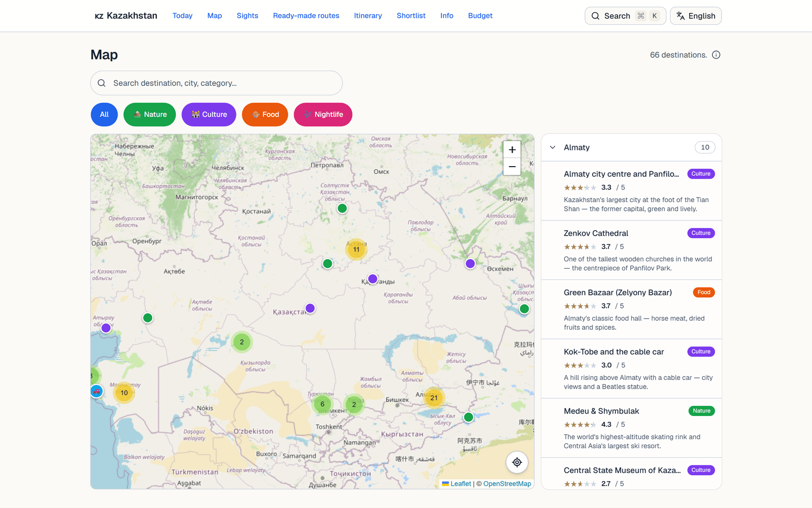
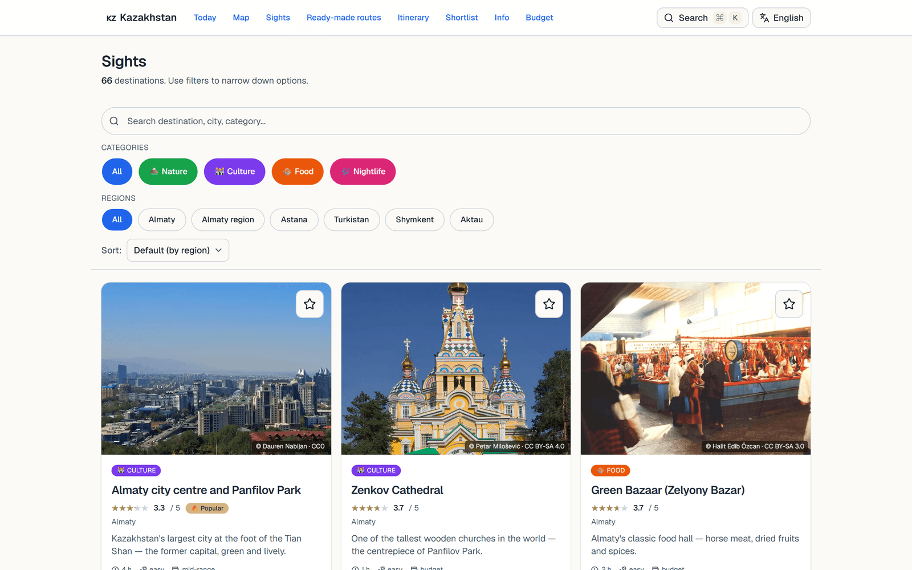
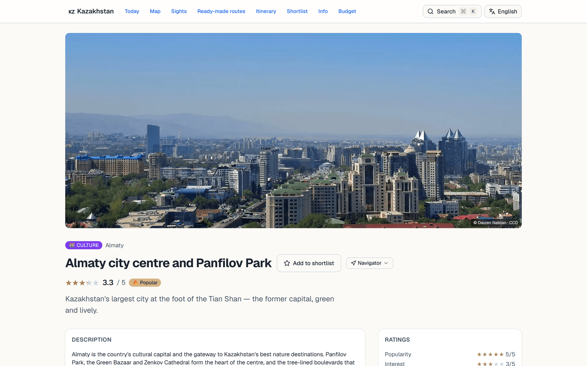
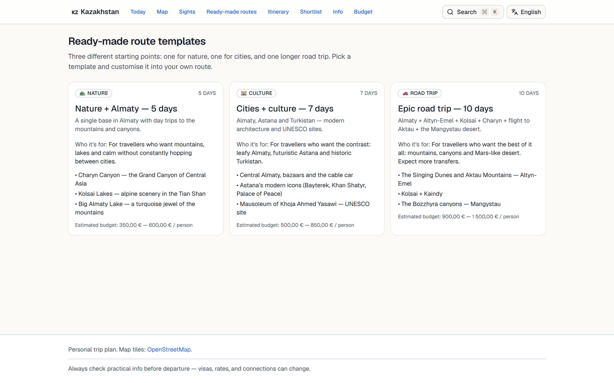
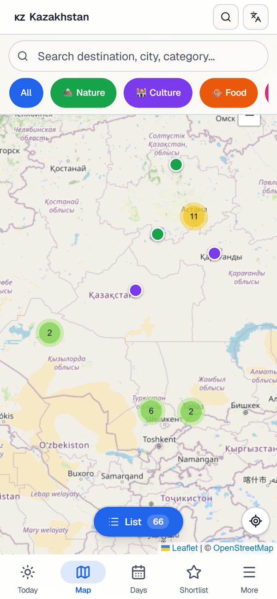

<div align="center">

# 🇰🇿 Kazakhstan Trip Planner

**An offline-first travel companion for a real trip across Kazakhstan — built to live in your pocket on the road, not just on the couch before you go.**

[](https://kazakstan.vercel.app/)

[](https://nextjs.org/)
[](https://react.dev/)
[](https://www.typescriptlang.org/)
[](https://tailwindcss.com/)
[](https://leafletjs.com/)
[](#-engineering-highlights)
[](./LICENSE)

</div>

<div align="center">
  
</div>

---

## ✨ Why this exists

Most trip-planning tools are designed for the *browsing* phase — at home, on a big screen, before you've bought a ticket. This one is built for the opposite moment: **standing at a trailhead in Charyn Canyon with cold fingers and one bar of signal**, trying to decide where to go next.

So it's a **decision tool for two travellers**, not a catalogue. It runs offline, it's built for thumbs, and every sight is one tap away from turn-by-turn directions in your phone's native maps app.

> No database. No login. No CMS. The entire content set lives as **typed TypeScript modules** — versioned, type-checked, and reviewed like code.

---

## 🚀 Features

| | |
|---|---|
| 🗺️ **Interactive map** | 66 curated sights with marker clustering, category/region filters, and list ↔ map sync |
| 🔍 **Instant full-text search** | Diacritic-insensitive, multi-language, zero dependencies |
| 🌍 **4 languages** | Finnish · English · Russian · Kazakh — fully translated UI *and* content |
| 📴 **Works offline** | One-tap *Download trip* provisions every sight, photo and your chosen map regions into eviction-proof caches — the whole trip works with zero signal |
| ⭐ **Smart ranking** | Sights rated on *popularity*, *interest* & *uniqueness*; sort and filter by any dimension |
| 📋 **Shortlist & share** | Save favourites, sync them via the URL, and share with a travel companion (Web Share API) |
| 🧭 **Itineraries & presets** | Ready-made multi-day routes plus a personal day-by-day planner |
| 💸 **Budget & logistics** | Per-region cost estimates (€ ↔ ₸), car-rental notes, visa & safety info |
| 🌓 **Dark mode** | System-aware theme, WCAG-compliant tap targets, no iOS auto-zoom |

> Try the [**live demo**](https://kazakstan.vercel.app/) — install it to your home screen and turn on airplane mode to see the offline mode in action.

---

## 🖼️ Screenshots

<table>
  <tr>
    <td width="50%"><br/><sub><b>Sights</b> — filter, sort & search 66 destinations</sub></td>
    <td width="50%"><br/><sub><b>Detail</b> — practical info, ratings & one-tap navigation</sub></td>
  </tr>
  <tr>
    <td width="50%"><br/><sub><b>Routes</b> — ready-made multi-day itineraries</sub></td>
    <td width="50%" align="center"><br/><sub><b>Mobile</b> — thumb-friendly bottom tab bar</sub></td>
  </tr>
</table>

---

## 🛠️ Tech Stack

| Layer | Choice | Why |
|---|---|---|
| **Framework** | [Next.js 16](https://nextjs.org/) (App Router) + React 19 | Static generation for a fast, free, CDN-served site |
| **Language** | TypeScript 5 | Content-as-code with compile-time guarantees |
| **Styling** | [Tailwind CSS v4](https://tailwindcss.com/) (CSS-first `@theme`) | Design tokens in CSS, no config file |
| **UI** | Radix UI · shadcn · lucide-react · sonner · Motion | Accessible primitives + polished interactions |
| **Maps** | [Leaflet](https://leafletjs.com/) + react-leaflet 5 + markercluster | Open data (OpenStreetMap), no API keys, no billing |
| **i18n** | [next-intl](https://next-intl.dev/) | Server-component-safe, type-safe message keys |
| **Theming** | next-themes | System-aware dark mode |
| **Deploy** | [Vercel](https://vercel.com/) | Zero-config, automatic preview deploys |

---

## ⚡ Getting Started

> Requires **Node 20+** and **[pnpm](https://pnpm.io/)**.

```bash
git clone https://github.com/veikkope/kazahkstan.git
cd kazahkstan
pnpm install
pnpm dev          # → http://localhost:3000
```

Other scripts:

```bash
pnpm build        # production build
pnpm start        # serve the production build
pnpm typecheck    # tsc --noEmit
pnpm lint         # ESLint
```

No environment variables, no API keys, no database — clone and run.

---

## 🧠 Engineering Highlights

The interesting parts I deliberately spent time on:

- **Offline-first PWA, by hand.** A custom [service worker](./public/sw.js) runs two cache tiers: a *reactive* one (network-first HTML, LRU-bounded tiles/images as you browse) and a *proactive* **“Download trip for offline”** that fetches every sight page, its JS/CSS/image assets and your chosen map regions’ tiles into eviction-exempt caches. So the **entire** trip works with no signal in the steppe — not just the pages you happened to open. The map’s runtime-imported Leaflet bundle is warmed in a hidden iframe so even an unvisited map renders offline.

- **i18n where drift is a compile error.** Every localized field is typed as `Record<Locale, string>` across all four languages. Forget a Kazakh translation and the build *fails* — not production. One canonical language (`fi`), per-entry `lastTranslated` timestamps to detect stale copy.

- **Marker clustering against a moving target.** `react-leaflet` 5 ships no cluster component, so the cluster layer is built **imperatively** via `useMap()` against the raw Leaflet API — including `zoomToShowLayer` so a list click opens the right cluster *before* flying to the marker.

- **Content as code, not a CMS.** All 66 sights are typed objects, statically generated with `generateStaticParams`. Each photo carries real **Wikimedia attribution** (author + licence) shown in a clickable © chip.

- **Built for thumbs.** Mobile bottom tab bar, sticky per-sight action bar, every tap target ≥ 44×44 px (WCAG), 16 px inputs so iOS Safari won't auto-zoom, and `prefers-contrast: more` honoured.

📐 A deeper write-up of these decisions lives in **[`docs/ARCHITECTURE.md`](./docs/ARCHITECTURE.md)**.

---

## 🤖 Built with an AI agent pipeline

This repo is also an experiment in **agent-assisted content engineering**. The 66-sight dataset is researched, rated, and maintained by a chain of purpose-built [Claude Code](https://claude.com/claude-code) subagents — each with a single responsibility and tightly scoped file access:

```
sight-adder        → drafts a new sight (coords, metadata, status: draft)
        │
deep-researcher    → multi-source research → src/research/<slug>.md
        │
place-rater        → read-only: proposes 0–5 ★ on popularity/interest/uniqueness
        │
sight-enricher     → applies ratings + history + tips to sights.ts (only writer)
        │
source-verifier    → read-only fact-check of time-sensitive data before deploy
```

Read-only agents never write; write access is exclusive and per-entry. The conventions that keep this safe are documented in [`CLAUDE.md`](./CLAUDE.md).

---

## 📁 Project Structure

```
src/
├── app/[locale]/        App Router pages, locale-prefixed (/en/map, /fi/sights …)
├── components/          Feature-grouped UI (map · sights · itinerary · layout …)
├── data/                Typed content (sights, presets, budget, checklist …)
├── i18n/                next-intl routing & request config
├── lib/                 Helpers (types, filters, search, url-state, shortlist …)
└── proxy.ts             Locale detection + redirect
messages/                UI strings per locale (fi · en · ru · kk)
public/                  Service worker, manifest, icons, Leaflet markers
.claude/agents/          The content-engineering subagents
```

---

## 💡 What I learned

- **Self-hosting a service worker** teaches you a lot about cache invalidation, the navigation fallback dance, and why "offline" is a spectrum, not a switch.
- **Type-enforced i18n** is worth the upfront boilerplate: a translation can never silently go missing, which is exactly the bug class that plagues multilingual apps.
- **Working against a library's gaps** (clustering in react-leaflet 5) means reaching for the imperative API underneath — and understanding the abstraction you usually take for granted.
- **Scoping AI agents narrowly** (one job, least-privilege file access) produces far more reliable results than a single do-everything prompt.

---

## 📄 License

The **code** is released under the [MIT License](./LICENSE) — use it, learn from it, build on it.

The **sight photos** are sourced from Wikimedia Commons under their respective Creative Commons licences (CC0 / CC-BY / CC-BY-SA); each retains its original attribution in the app. They are **not** covered by the MIT license.

---

<div align="center">
<sub>A personal project for one specific trip. Generality (multi-user, theming, a backend) is intentionally out of scope — and that's the point.</sub>
</div>
